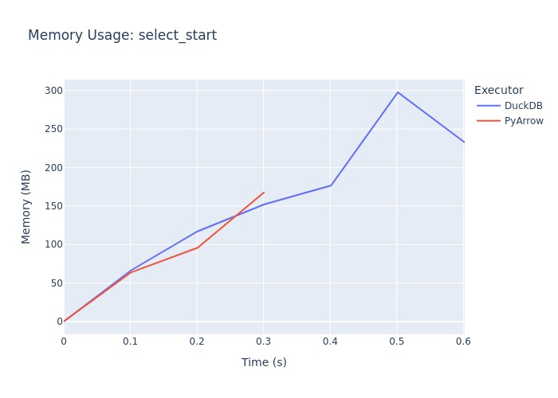
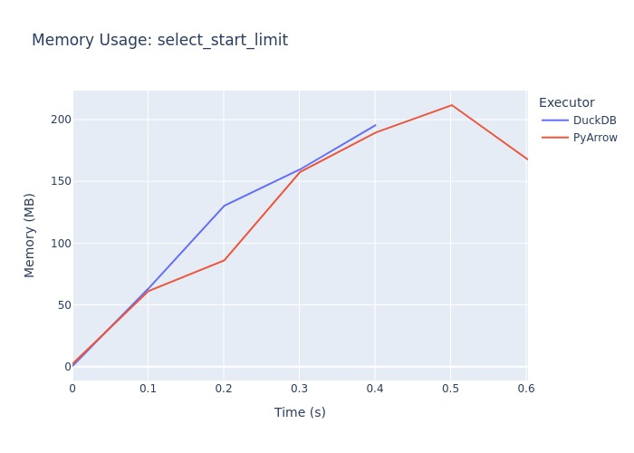
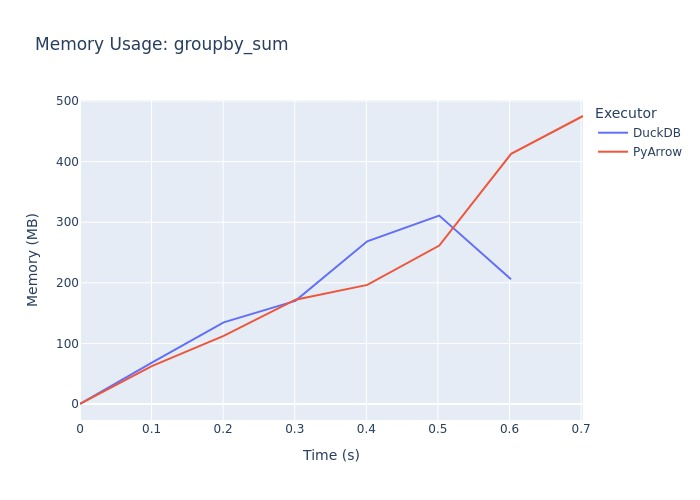
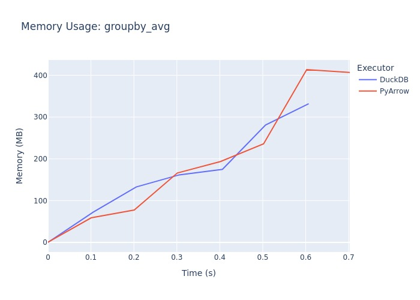
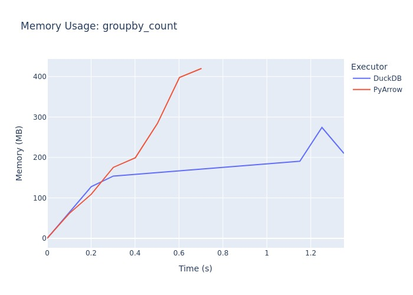
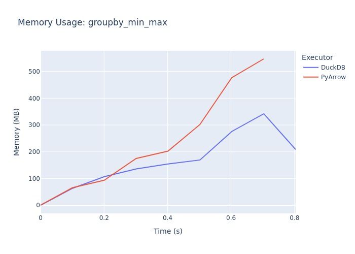
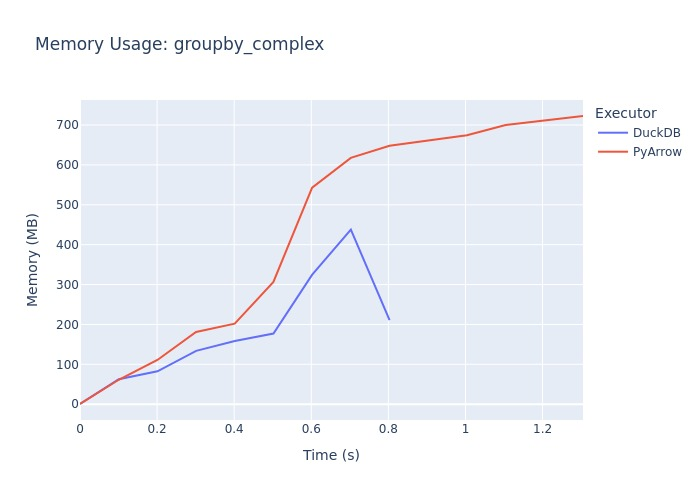

# Arrow Flight DuckDB

A Python library for connecting DuckDB with Apache Arrow Flight data sources.

## Description

This project provides integration between DuckDB and Apache Arrow Flight, allowing you to:

- Connect to Arrow Flight servers and retrieve data
- Process data using DuckDB's SQL engine
- Work efficiently with Arrow data without copying
- Register Arrow Flight data as DuckDB views and tables

## Installation

```bash
pip install arrow-flight-duckdb
```

## Requirements

- Python >= 3.13
- DuckDB >= 1.1.3
- PyArrow >= 18.1.0
- NumPy >= 2.2.1
- Polars >= 1.19.0

## Usage

Here's a simple example of using the `DuckdbClient` to work with Arrow Flight data:

```python
from arrow_flight_duckdb import DuckdbClient

# Create a DuckDB client
client = DuckdbClient()

# Register Arrow Flight data as a view
client.register_reader(flight_reader, "my_view")

# Query using DuckDB SQL
result = client.execute("SELECT * FROM my_view").fetchall()

# Persist data as a DuckDB table
client.persist("SELECT * FROM my_view", "my_table") 
```

## Development

To set up development environment and run tests:

```bash
# Install dependencies 
pip install -e .

# Run tests
make test

# Run linting
make lint

# Fix code formatting
make fix

# Run benchmarks
make benchmark
```

## Benchmarks

The project includes benchmarks comparing DuckDB and PyArrow performance for various operations:

- Simple SELECT queries
- SELECT with LIMIT
- GROUP BY operations:
  - COUNT
  - SUM
  - AVG
  - MIN/MAX
  - Complex aggregations
Run benchmarks and generate performance metrics:

```bash
# Run all benchmarks
make benchmark

# Results will be saved in benchmark_results/ directory
```

### Benchmark Results








## License

This project is licensed under the MIT License. See the LICENSE file for details.
